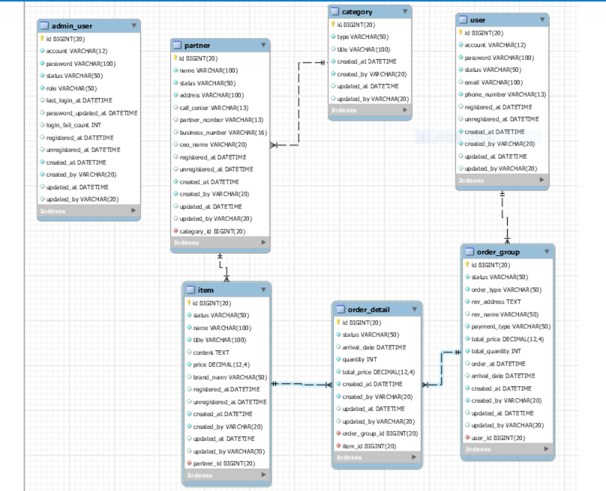

## Admin project
- 서비스 이해 및 용어, 환경, 데이터베이스 구성, 비즈니스 흐름 파악하기

## ERD


## 서버 개발자란
- 국내에선 스프링 사용하기에 자바개발자라고도 함.
- 웹 프로그래머(Back-end developer)
  - Back-end
  - Jsp, Spring, Asp, Php, Aka, Jango...
  - 데이터베이스로 부터 데이터를 가공하여 요청한 Client에 제공

## 통신이란

### Socket 통신
- 접속을 계속 유지하며 데이터를 전달 한다.
- 서버의 자원에 따라서 연결될 수 있는 클라이언트의 숫자가 한정
- 실시간 정보 교환에 사용하며 HTTP보다 속도가 빠름

### HTTP 통신(웹에서 통신하는 방식)
- 클라이언트의 요청이 있을 때만 데이터 응답을 전달
- 불필요한 자원의 점유를 없애 다른 접속을 원할하게하여 많은 데이터 처리
- 데이터 요청 후 응답이 오면 연결은 끊어짐

## 목표
- admin 사이트

```
            HTTP
클라이언트 <------->  서버(http://localhost:8080/)
            HTTP

```

- 7 TABLE
- Spring boot 사용(JPA, 데이터 가공)
